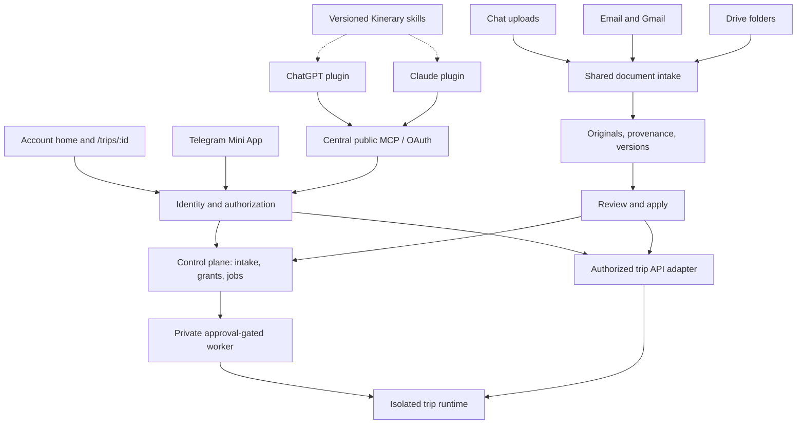

# Connected assistants and account-wide intake — Codex-managed plan

Status: planning authorized; product implementation not started. Updated 2026-09-26.
Lead: Codex dev manager. Product owner and merge/deploy authority: Dror.
Claude remains lead of Sprint 6. This is a separate initiative, not Sprint 7
(which already names post-trip learning), and adds nothing to Sprint 6's exit gate.

## 1. Branch decision and authority

Planning branch: `feat/connected-assistants-plan`, created from
`integration/sprint-6` at `7d0a14c2ece8b6fe459773eec9446edba09abdc4`.
Remote heads were checked on 2026-09-26: Sprint 6 matched that revision;
`main` was `fbf38997ec643035e49f690c4e3f2c148d4894f1`.
`git rev-list --left-right --count origin/main...HEAD` at the source returned
19 main-only and 250 integration-only commits. These are divergent branches,
not interchangeable release baselines.

The main-only log includes the trip MCP, config allow-list, document MIME fix,
trip-day/weather fix and ticketed-confirmation retention. Commit-count divergence
does not prove those changes are absent from Sprint 6: some were carried as new
commits. CA-00 must reconcile relevant behavior and carry records before each
implementation base is selected; do not cherry-pick that whole list blindly.

**Use Sprint 6 for this planning lane.** It contains the authoritative account,
intake, document and team-workflow foundations needed here. Starting the whole
initiative on main would encourage rebuilding or carrying partial versions of
those foundations. This is not permission to release Sprint 6 early.

The planning PR targets `integration/sprint-6` and changes only this initiative's
documents. Dror retains its merge decision. No feature code rides on that PR.
After Sprint 6 lands on main, new implementation briefs pin the then-approved
main revision; no long-lived branch silently accumulates an alternative product.
If independent implementation starts before that, each task needs an explicit
base and integration target agreed at the shared queue; overlapping paths wait.
An urgent production document fix, if separately commissioned, branches from
current main and is carried forward once, through the existing #227/#163 owners.

Do not edit `.project/sprint.json`, redefine the sprint baseline, create an
unapproved Sprint 8, or change the Claude-led plan's statuses. Its authoritative
copy stays on the active integration branch. This document is initiative scope
and decisions; GitHub issues are the work queue, not a second sprint ledger.

## 2. Product outcome and scope

One Kinerary account and one OAuth MCP connection let an authorized person
create a trip, complete intake in ChatGPT or Claude, confirm it, follow existing
provisioning/activation approvals, then manage the resulting trip. Telegram is
optional. Existing hosted assistance remains available for Telegram and
background jobs; external assistants replace redundant conversational model
calls where they perform the work themselves.

Account home manages trips, people and roles, assistant grants, Gmail/Drive
connections, import review and access history. Effective access is always the
intersection of account identity, trip membership, connector grant and action
permission. Account-level management never makes one trip's organizer a global
organizer. New trips must follow the connection's explicit grant policy; do not
silently add every future trip to an existing assistant grant.

Incoming sources: chat files; forwarded email bodies and attachments; a Drive
folder shared through a chat; optional reviewed Gmail discovery; later scoped
ongoing synchronization. A shared folder may be accessed through organizer OAuth,
explicit sharing with a designated Kinerary principal, or a public link. Public
sharing is optional; a link neither proves ownership nor selects the destination
trip. Shared-principal access requires per-organizer grants and isolation too.

Excluded: purchases, billing, post-trip memory implementation, broad mailbox
automation by default, photo-library scanning, replacing the isolated runtime
databases, retiring all trip subdomains in one release, and changing production
model bindings. Model suggestions below concern the development team only.

## 3. Relationship to existing work

| Existing authority / queue | Relationship and collision rule |
|---|---|
| [Agent team plan](../agent-team-plan.md), CLAUDE.md, AGENTS.md | Same roles, briefs, independent verification, one writer/path, human merge and deploy gates; no parallel policy copy |
| [Sprint 6 tracks](../sprint6-tracks.md), track 2 | Claude owns current account/portal/dashboard work and sprint delivery; reuse it, agree handover before editing shared paths |
| [Web integration plan](../web-control-plane-integration-plan.md), [landing plan](../landing-page-plan.md) | Extend existing global users, identity resolution, memberships and runtime handoff; never introduce a competing user registry or new portal |
| [Document intake plan](../document-intake-feature-plan.md), PR #116, #163, #214, #216, #217 | Reuse stored originals, provenance and correction workflow. Bootstrap and live-document follow-ups remain with existing owners. Distinguish transport failure from missing public upload capability |
| #227 and main PR #220 | Existing per-trip MCP is the compatibility foundation; central OAuth is an evolution, not a second unrelated trip tool catalog |
| #195, #186 | Item visibility and consent are dependencies; do not decide their open product questions through connector code |
| #154, #206, #209 | Active-trip changes, explicit correction proposals and booking cancellation facts are reused rather than reimplemented |
| #126, #107 | Account recovery and operator/runtime recovery are different capabilities; consume the agreed account path |
| #240, #246 | Skill export must remove concrete example people and personal facts; coordinate the shared skill audit |
| [MVP sprint plan](../onboarding-mvp-sprint-plan.md), section 5 | Gmail/additional-channel deferrals remain release constraints. This plan prepares the next work, not a Sprint 6 scope expansion |
| Existing Sprint 7 | Post-trip learning remains separately owned and sequenced; this initiative does not rename or replace it |

Open PRs observed 2026-09-26: #116 document store bootstrap and #245 companion
example-person fix target Sprint 6; #229 carries test reports to main. This is
a dated snapshot, not a claim that any remains open at task dispatch.

## 4. Architecture and ownership of data

One public MCP does not require eliminating subdomains. Introduce central
authorization and an account-facing route namespace first; retain direct trip
origins during migration. An account cookie or assistant token must not become
an unscoped runtime agent key. The existing shared gateway refuses per-trip MCP
OAuth consent for a reason: a new central consent origin needs its own reviewed
session, CSRF, audience and delegation design, not removal of that refusal.

Control plane owns accounts, grants, membership and lifecycle; each runtime
continues to own its operational records. The connector resolves authorized
trip context explicitly and checks every request. Conversation memory and an
arbitrary trip id are never authorization. Version checks prevent two assistants
overwriting each other's edits; idempotency keys make retries safe.

Provisioning and activation remain separate durable approval-gated steps.
Intake confirmation is not authorization to provision or publish. An assistant
reports requested/pending/ready states truthfully and resumes asynchronous jobs.
`mcp/provision.js` remains private. Browser account creation/consent/review is
allowed inside the overall assistant-led journey; credentials never enter chat.

## 5. Document contract and Orlando evidence

Read-only investigation on 2026-09-26 against main `fbf3899` and Orlando:
the live `server/trip-mcp/tools.js` and `server/server.js` hashes matched main.
Eight bookings existed, none had `conf_file`; both confirmation directories
contained zero files. The public connector had no confirmation upload/download
tools. The internal upload tool required a server-local PDF path. These facts
prove the public transport gap, not the history of any particular conversation
or the absence of originals in other source systems. No files were recovered.

Every adapter must implement:

1. Authorize the source and destination trip; save original bytes and provenance.
2. Validate type/size, isolate document processing, and checksum the stored data.
3. Extract grounded facts; propose matches or replacements without invented values.
4. Deduplicate across email, Drive and chat; distinguish exact copies from revisions.
5. Review/apply through the existing correction contract; preserve prior versions.
6. Link to bookings and, where appropriate, active-plan items; read back and open
   the authenticated document before claiming complete success.

Return independent states for original stored, facts recorded, booking linked
and itinerary linked. Retry after partial failure must converge without duplicates.
A missing booking must fail attachment linkage rather than returning false success.
The main upload route currently updates without checking a matched row; include
this in the public-document task and coordinate the production owner.

Temporary assistant file URLs are transport references, never permanent assets.
ChatGPT's file input support can provide downloadable references. Claude transfer
needs a real client spike; provide an authenticated upload panel/link when bytes
cannot be transferred. Do not export the server-local path tool. Support original
screenshots and email attachments as well as PDFs through the common store.

Email forwarding needs a receiving-provider webhook contract, replay protection,
rotatable trip routing addresses, sender verification/review, size limits and
quarantine. A guessed forwarding address or forged From header cannot approve a
write. Preserve useful email text as well as attachments; never send replies or
mail on the organizer's behalf without a separately authorized feature.

Drive: explicit one-time import first, preview file count/types and target trip,
bounded recursive traversal, safe redirects/downloads, no arbitrary internal URL
fetching, then optional change synchronization. Source deletion does not silently
delete retained trip documents. Revocation stops future reads and queued work.
Gmail: minimum necessary scopes, review-first matching, declared search/time scope,
no send/delete capabilities, incremental consent and provider verification assessment
before credentials or public launch. Token storage is restricted to the backend.
Imported-content retention and deletion are explicit, distinct from disconnecting.

## 6. Skills and channel UX

Four portable workflows: onboarding; confirmation intake; daily planning and
changes; companion context/privacy. Reuse `.agents/skills/` insights and generate
platform packaging from one reviewed source. Remove local path, Hermes tool,
Telegram-button and specific-family assumptions. Resolve conflicting phase rules
before publishing. Skill and tool contract versions travel together.

Server validation enforces permissions, confirmations and required data even if
a skill is missing or ignored. Skills enforce conversational pacing, document-first
questions, fixed-anchor planning, private-needs handling and honest completion.
Cross-client evaluations include restart/resume, bilingual inputs, prompt injection,
misleading success, duplicate files and a member trying organizer actions.

Mini App refinement: private view for onboarding, imports and account controls;
group entry for Today, itinerary, authorized documents, RSVP and trivia. Reuse
`web/` and `trip-web/` components where their responsibilities fit, not a third app.
Group direct links do not grant chat-reading or posting rights. Signed Telegram
launch data is context until an approved account association authenticates it.
Existing policy retires Telegram SSO. Safe initial design uses existing account
sign-in/handoff in the webview; any future Telegram-derived account login needs
an explicit policy decision. Mini App acceptance is not approval to reopen the
retired `/v1/auth/telegram` route. Validate feasibility and mobile UX first.

## 7. Managed delivery queue

GitHub is the execution queue. Tasks below are planned, not `agent:ready`.
Issue links are maintained in [connected-assistants-queue.md](connected-assistants-queue.md).
Before dispatch the manager writes the full Appendix B brief with an exact base,
owned paths, exclusions, model/effort, suites, isolated test DB and acceptance.
The path candidates below are not live claims.

| ID | Work package / size | Depends on | Candidate surface | Acceptance |
|---|---|---|---|---|
| CA-00 | Contract and coexistence design / M | Current plan | This initiative's docs only | Existing owners and interfaces mapped; identity/delegation and document contracts reviewed; release boundary explicit |
| CA-01 | Reliable public confirmation transport / M | CA-00; #227/#163 coordination | `server/trip-mcp`, booking route, store adapter, tests | ChatGPT and Claude upload path each proven; retrieve original from site; retry/replacement/no-row behavior correct |
| CA-02 | Central account grants and trip access / L | CA-00; account owner handover | `portal.ts`, identity/membership, `web/`, migrations | One person with differing roles across two trips; revoke grant/membership; no cross-trip access; existing logins work |
| CA-03 | One OAuth MCP through onboarding and trip management / L | CA-01, CA-02; document store and lifecycle foundations | New MCP facade, interview adapter, runtime delegation | No Telegram dependency; resume in other client; exact-version confirmation; job status and existing approval gates preserved |
| CA-04 | Portable skills and two plugin packages / M | CA-00; CA-03 contract; #246 | New package outputs and reviewed skill sources | Real install/consent in both apps; restart and document-first evaluations pass; no family-specific example leakage |
| CA-05 | Forwarding inbox and one-time Drive folder import / L | CA-01, CA-02 | Provider adapters, import review, storage | Forward body+attachment; private/public folder import; denied access, spoof/replay, duplicates and failed fetches handled |
| CA-06 | Reviewed Gmail and optional source synchronization / L | CA-05; consent/provider review | Service connections, jobs, review UI | Bounded discovery, organizer approval, revocation stops pending reads; no mailbox writes; measured matching precision |
| CA-07 | Telegram Mini App refinement and implementation / M then L | CA-02; UX/auth decision | `web/`, `trip-web/`, bot entry points | Private and group launch on mobile; secure account association; role-appropriate screens; no retired SSO route |
| CA-08 | Pilot, migration and release gate / L | Required prior slices; stable MVP | Tests, release/run documentation | Account/assistant/source matrix passes on named build; rollback, subdomain compatibility and pilot evidence approved |

Sequence: CA-00; CA-01 and CA-02 only where path-disjoint; CA-03; CA-04.
CA-05 can proceed after its dependencies, independently of plugin packaging.
CA-06 follows measured import reliability. CA-07 starts with the pending UX/auth
design rather than treating a chat mockup as final. CA-08 releases small slices,
not one mandatory all-or-nothing launch. Gmail provider review and directory review
are external lead times; no calendar delivery promise is made before the spikes.

Size is relative engineering effort, not elapsed duration. Estimate each dispatch
in suite minutes, expected review rounds and live/infra minutes per the team plan.
Each implementation PR ordinarily costs one human merge decision; each production
release has a separate deploy decision. After two review rounds, correctness or
security defects remain blockers; a third round requires the owner's decision,
per standing policy.

## 8. Coordination, claims and resumption

Codex writes briefs and orders this initiative; developers own code in isolated
worktrees. Verifier proves results; boundary-reviewer audits security with live
request/response evidence; integrator prepares merge decisions; regression-planner
assesses auth/migrations/relay and every release; doc-keeper records rationale;
sprint-scribe handles the existing sprint ledger, not this lead.

Before each dispatch, read the current shared issue queue, open PRs, latest base
CI and the Claude-led claims. Claim exact paths in the issue before work; a missing
claim is not evidence a shared path is free. Shared account, interview, document,
relay, model-runner and migration-table paths require explicit owner handover.
If blocked, advance only disjoint docs/contracts/fixtures. Never revert another
session's work. Do not close or reassign existing issues merely because this plan
references them. No infrastructure window is claimed by this planning task.

Current live claim: Codex lead owns only
`docs/future/connected-assistants-plan.md` and
`docs/future/connected-assistants-queue.md` on the planning branch.
All product paths are unclaimed by this initiative.

Use `cptest_ca_<task>` for DB-backed work; never shared `cptest` or production.
No shared-stack rebuilds while Claude holds the infrastructure window. Follow
the existing timestamped migration/rollback-header rules and serialize changes
to the same table. Staging fixtures use synthetic travelers and documents.

Resume checklist: read this plan and queue, CLAUDE.md and `.project/sprint.json`;
verify branch/base and clean status; run mirror check; inspect issue/PR changes;
write a complete task brief and claim before spawning developers. No issue in
this initial queue authorizes product implementation by itself.

## 9. Codex mirror and proposed team improvements

Observed 2026-09-26: `scripts/sync-codex-agents.py --check` reports
`codex mirror is current`; `scripts/project-state.py check` passes. Role text
comes from `.claude/agents/*.md`; `.codex/agents/*.toml` is generated. Never hand
edit it. `.codex/hooks.json` matches the hooks object in `.claude/settings.json`.
File equality does not prove hooks are enforced in every client; this turn's
runtime permissions remain authoritative.

The generator deliberately omits Claude frontmatter model/effort/tools/isolation.
Consequently text parity is not execution-policy parity. Current official Codex
documentation supports per-agent model and effort settings. Suggested follow-up,
not applied: retain one role source, add a reviewed provider-specific mapping,
generate supported settings, and test actual runtime refusal/isolation with safe
probes. Preserve read-only verifier/reviewer/consult roles; do not infer that
every runtime has the same tool filtering from matching prose.

Recommended Codex dispatch defaults (proposals, no global settings changed):

| Task | Model / effort | Reason |
|---|---|---|
| Routine lead coordination and bounded development | GPT-6 Sol / medium; high for complex changes | Balance reasoning with iteration cost |
| OAuth, delegation, migration design; boundary review; ambiguous conflict | GPT-6 Astra / high | Concentrate strongest review on consequential judgments |
| Verifier and integrator | GPT-6 Sol / medium, high for complicated failure analysis | Independent evidence and careful integration |
| Documentation, scribe and simple queue scans | GPT-6 Sol / medium; trial Luna / high on narrow scans | Lower tier only after it preserves provenance and catches drift |
| Security approval or final cross-trip access assessment | Astra / high | Do not assign this to a cheap triage pass |

These are recommendations, not benchmark results. Claude's existing role/model
assignments stay untouched. Record actual model, effort, role-source revision,
base and tool restrictions in each handover. Compare rework, missed defects,
wall time, tokens and human approval load over the first three tasks; adjust
from evidence rather than changing production model bindings or assuming price
per token equals cost per completed task.

Further improvements to propose through the existing policy owner: a shared
machine-readable claims registry across leads; launch checks proving actual
worktree isolation; a reusable data contract test suite for every intake adapter;
explicit skill/tool compatibility versions. Do not implement policy changes in
this documentation PR. The consult used this turn lacked local Read tools, so
the manager supplied bounded excerpts; record capability gaps instead of granting
a read-only role shell access as a workaround.

## 10. Acceptance and rollout evidence

Before customer pilot: two organizers, a member and two trips; differing grants;
cross-trip id substitution refused; revoked grants fail on next request; no
organizer-only facts in shared output; missing/ignored skills cannot bypass
server checks. Refresh/retry/resume must not duplicate drafts, bookings or jobs.

Document fixtures cover PDFs/screenshots/email wrappers, multilingual names,
same file via three sources, changed reservation, partial storage failure,
expired download reference, blocked MIME/size, malicious URL/content and revoked
Drive/Gmail access. Verify original retrieval and visible booking/plan links,
not merely successful tool calls. Preserve existing mobile/subdomain login paths.

Each release uses a named immutable build, regression assessment, rollback plan,
existing deployment gate and isolated pilot. Measure installation completion,
onboarding completion, repeated questions, saved-and-retrievable originals,
false import matches, duplicate bookings, internal model calls/cost and support
interventions. Expansion requires no cross-trip disclosure or silent data loss;
product metric targets are set after the initial measured baseline.

## 11. Sources and evidence limits

Repository links above are authoritative for current ownership; proposals are
labelled as such. Orlando observations are from the preceding read-only task,
not a new live probe or proof that recovery was performed. No runtime tests or
provider integrations were run for this planning-only change.

- [OpenAI plugin packaging](https://developers.openai.com/plugins/build/plugins)
- [OpenAI file input metadata](https://developers.openai.com/plugins/reference)
- [Claude plugin bundles](https://claude.com/blog/build-plugins-for-claude)
- [Telegram Mini Apps](https://core.telegram.org/bots/webapps)
- [Codex subagent settings](https://learn.chatgpt.com/docs/agent-configuration/subagents)
- [OpenAI model selection](https://developers.openai.com/api/docs/guides/model-selection)

Platform documentation was checked during planning on 2026-09-26. Before building
Gmail/Drive adapters, recheck official provider scopes, verification, public-link
handling and service-principal support; no production credential setup is authorized.
