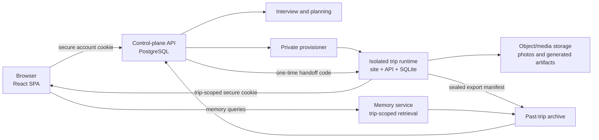

# Kinerary web, control-plane, and trip-memory integration plan

**Status:** proposed implementation plan

**Scope:** landing SPA, global account, trip creation, interview/control-plane handoff, active trip access, and completed-trip memories

**Design direction:** the visual language introduced by the landing SPA becomes the future shared design system for active and past trips

## 1. Product outcome

One Kinerary account should follow a traveler through the entire trip lifecycle:

1. A visitor starts on the vacation-oriented landing page and enters a trip name or early trip details.
2. The visitor signs up with Google or email/password, or signs in to an existing account.
3. Kinerary saves the trip as a durable draft owned by that account. Refreshes and OAuth redirects must not create duplicates.
4. The owner starts or resumes the control-plane interview, confirms the intake, reviews the plan, and passes the existing approval/provisioning gates.
5. When a private trip site is ready, Kinerary securely signs the member into that exact site. Passwords and provider credentials are never copied into a trip runtime.
6. While active, the trip site remains the operational experience for the itinerary, day plan, bookings, participants, photos, comments, ratings, and locations.
7. When the trip ends, operational writes stop. A sealed snapshot becomes the source for a private past-trip memory experience in the account SPA.
8. From that past-trip page, authorized members can browse photos and places, ask questions about their memories, create shareable artifacts, and—only with explicit consent—rate or publish selected material.

The first release should complete steps 1–5. Past-trip memories are intentionally phased after account, membership, provisioning, and isolation are proven.

## 2. Architecture

The system keeps three boundaries explicit:

- **Global account and lifecycle:** control-plane PostgreSQL owns accounts, identities, memberships, trip metadata, lifecycle, approvals, runtime endpoints, consent, and archive manifests.
- **Active trip operations:** each isolated trip runtime owns the live itinerary and operational SQLite data. Its current `ratings`, `photos`, `venue_comments`, `photo_reactions`, `photo_comments`, RSVPs, bookings, and day-plan data stay isolated.
- **Media and memories:** object storage or Immich owns binary assets. The database stores stable references, digests, captions, permissions, and derived-artifact metadata—not image or movie blobs. Completed-trip retrieval reads only the selected trip's sealed archive.

The public web application does not call the private provisioner. All provisioning remains queued and approval-gated through the control plane. `mcp/provision.js` remains LAN-only.

## 3. Current foundation and gaps

The control plane already provides much of the required backbone:

- provider-neutral users and identities;
- owner/organizer/member trip memberships;
- a lifecycle from draft through active, completed, and sealed;
- versioned interview intake, plans, jobs, resources, evidence, and activations;
- Telegram signup approval and interview enrollment;
- provisioning that records a `private_url` in the successful job result and notification payload;
- organizer profiles, trip contexts, messaging bindings, service connections, and audit events.

The implementation must add:

- browser sessions, Google OIDC, verified email/password signup, password reset, and account recovery;
- a provider-neutral web identity path instead of assuming Telegram on member reads;
- a durable trip display name and draft metadata;
- create/list/update trip APIs for the account SPA;
- a durable runtime endpoint record instead of discovering the URL from a job result;
- a one-time account-to-runtime handoff;
- a stable mapping between global users and per-trip participants;
- completion export, sealed archive, and consent-aware memory models;
- a shared design system and phased active-trip visual refresh.

## 4. Account and authentication plan

### 4.1 Global identity model

Keep `control_plane.users` as the person/account record and `user_identities` as provider identities. Add:

- `email_identities`: normalized email digest, encrypted/restricted normalized email where delivery requires it, verification state, and timestamps;
- `password_credentials`: user ID, Argon2id password hash, credential version, changed timestamp, and compromised/disabled state;
- `web_sessions`: random session digest, user ID, expiry, last-seen time, rotation family, revoked timestamp, IP-risk metadata, and user-agent digest;
- `account_action_tokens`: hashed, single-use email verification and password-reset tokens with purpose and expiry;
- optional `identity_link_events` for audited Google/email/Telegram linking and unlinking.

Google OIDC and verified email identities should resolve into the existing `user_identities` model. Account linking must require proof of both sides; matching an email string alone is insufficient.

### 4.2 Browser security

- Use a random opaque session in an `HttpOnly`, `Secure`, `SameSite=Lax` cookie.
- Rotate the session after login, password change, privilege change, and handoff creation.
- Protect state-changing endpoints with same-origin checks and a CSRF token.
- Do not store global access tokens, Google tokens, or password-reset tokens in local storage.
- Store only token digests in PostgreSQL; raw verification/reset tokens exist only in the outbound link.
- Apply rate limits and generic responses to login, registration, verification, and recovery endpoints.
- Record bounded security audit events without passwords, provider tokens, raw email addresses, or trip-private content.

### 4.3 Initial account API

| Method and path | Purpose |
|---|---|
| `POST /v1/auth/register` | Create pending email account and send verification |
| `POST /v1/auth/verify-email` | Consume the one-time verification token |
| `POST /v1/auth/login` | Start a rotated web session |
| `GET /v1/auth/google/start` | Start OIDC with signed state, nonce, PKCE, and validated return path |
| `GET /v1/auth/google/callback` | Verify OIDC response, resolve/link identity, and start session |
| `POST /v1/auth/logout` | Revoke current session and clear cookie |
| `POST /v1/auth/password/forgot` | Request a reset without account enumeration |
| `POST /v1/auth/password/reset` | Consume token, replace credential, and revoke older sessions |
| `GET /v1/me` | Return the minimal signed-in account profile and capabilities |

Telegram can remain an additional linked identity. It should no longer be the implicit identity provider in reusable helpers such as member-scoped trip reads.

## 5. Saving the trip started on the landing page

### 5.1 Pre-auth intent

The current SPA stores destination, dates, and trip type in `sessionStorage`. Extend this `TripIntent` with a human trip name and a client-generated `intentId`.

Pre-auth storage is a convenience, not the system of record:

- keep only nonsensitive draft fields in `sessionStorage`;
- attach a signed `intentId` or retain it server-side once authentication begins;
- validate OAuth `returnTo` against a same-origin route allowlist;
- after login, submit the intent once with `Idempotency-Key: trip-intent:<intentId>`;
- clear the local intent only after the API confirms the durable draft.

### 5.2 Durable trip metadata

Add a `trip_profiles` table rather than putting the full interview draft into `trips`:

- `trip_id` (one-to-one);
- `display_name`;
- destination summary;
- tentative start/end dates and timezone;
- trip type;
- locale and preferred language;
- cover-media reference when one is later selected;
- source (`landing`, `telegram`, `suggestion`, `import`);
- version and updated timestamp.

Keep `trips.slug` as an internal/deployment identifier. The display name is editable and must not be used as the authorization boundary or filesystem path.

### 5.3 Trip API

| Method and path | Purpose |
|---|---|
| `POST /v1/trips` | Create an idempotent draft and active owner membership |
| `GET /v1/trips` | List member-scoped upcoming, active, and past trip summaries |
| `GET /v1/trips/:tripId` | Return member-scoped metadata, lifecycle, next action, and capabilities |
| `PATCH /v1/trips/:tripId` | Update permitted draft metadata with optimistic version checking |
| `POST /v1/trips/:tripId/interview-enrollment` | Issue/resume the owner interview using the existing enrollment rules |

`POST /v1/trips` should create the trip and owner membership in one transaction. The existing super-admin signup approval can become a configurable policy gate instead of being inseparable from account creation; environments that require approval can create `pending_signup_approval`, while approved/self-service environments can create `draft`.

## 6. Interview and control-plane connection

The SPA should orchestrate the existing lifecycle rather than duplicating it.

For each trip, the API returns a server-derived `nextAction` and allowed actions, for example:

- `complete_profile`;
- `start_interview` or `resume_interview`;
- `review_intake`;
- `await_plan`;
- `review_plan`;
- `await_provisioning`;
- `open_private_trip`;
- `open_active_trip`;
- `open_memories`.

The browser never chooses a target lifecycle state directly. It invokes a narrow action, and the control plane applies the existing transition, membership, approval, expiry, version, and idempotency rules.

The first web interview can reuse the current interview API behind authenticated, member-scoped routes. The Telegram interview remains available and both channels must write the same versioned intake representation. A trip may have only one active writable intake session unless an explicit correction flow starts a replacement version.

## 7. Secure handoff into the active trip site

### 7.1 Do not copy credentials

The global account owns Google/email authentication. The isolated runtime owns a trip-scoped session. Do not copy password hashes, Google tokens, or the global session secret into runtime SQLite.

Add an external identity mapping to the runtime participant model:

- `control_plane_user_id` or a stable, pairwise trip-user subject;
- runtime username/display name;
- trip role;
- membership version and status.

Provision the initial owner mapping in the approved runtime manifest. Later member invitations reconcile the mapping through a narrow private adapter. Existing local/Telegram login can remain as a migration fallback until all participants use global handoff.

### 7.2 One-time handoff protocol

1. A signed-in member selects **Open trip** in the account SPA.
2. `POST /v1/trips/:tripId/handoffs` verifies active membership, lifecycle, runtime health, and the requested destination.
3. The control plane creates a random handoff code. PostgreSQL stores only its digest plus trip, user, role, runtime audience, return path, expiry, and unused state.
4. The browser is redirected to the recorded runtime endpoint at `/auth/handoff?code=<opaque-code>`.
5. The runtime exchanges the code server-to-server with `POST /v1/runtime/handoffs/exchange`, authenticating itself with its trip-scoped workload identity.
6. The control plane atomically marks the code used and returns the minimal trip-user claims.
7. The runtime resolves the participant and issues its own short-lived, trip-scoped `HttpOnly` cookie, then redirects to the validated in-site path.

Properties:

- 60–120 second expiry, single use, digest-only storage;
- exact trip and runtime audience binding;
- no global bearer token in a URL;
- no acceptance of model- or browser-supplied roles;
- membership rechecked during exchange;
- replay, wrong runtime, wrong trip, expired membership, and revoked membership fail closed;
- handoff creation and exchange are auditable without logging the raw code.

The active runtime currently accepts bearer JWTs stored by its frontend. Before enabling handoff, teach `authRequired` and organizer authorization to accept the secure trip cookie, add CSRF protection, and migrate frontend requests away from browser-stored bearer tokens. The legacy token path can be removed after a compatibility window.

### 7.3 Runtime endpoint registry

Do not make the dashboard scrape `jobs.result.private_url`. Add a `runtime_endpoints` record containing:

- trip and resource IDs;
- logical audience/hostname;
- internal exchange endpoint reference;
- state (`private`, `active`, `suspended`, `archived`);
- certificate/health evidence references;
- created, verified, suspended, and retired timestamps.

The provisioner writes this record transactionally when it reaches `ready_private`. The SPA receives an `openTrip` capability or control-plane handoff URL, not internal topology data.

## 8. Dashboard and lifecycle behavior

`GET /v1/trips` should return a normalized card model rather than raw control-plane rows:

- `id`, display name, destination summary, dates, cover reference;
- role and member count visible to that requester;
- lifecycle category: `draft`, `upcoming`, `active`, or `past`;
- safe progress label and next action;
- unread/action-needed counts;
- capabilities such as `canEdit`, `canInvite`, `canOpenRuntime`, and `canOpenMemories`.

Suggested SPA routes:

- `/trips` — account dashboard;
- `/trips/new` — durable creation flow;
- `/trips/:tripId/setup` — interview and readiness;
- `/trips/:tripId/open` — handoff initiation, never a raw runtime URL;
- `/trips/:tripId/memories` — sealed past-trip experience;
- `/trips/:tripId/settings` — membership, consent, retention, export, and deletion.

Known-trip suggestions remain a future source for `POST /v1/trips`; they should create a new owned draft from a versioned template, never grant access to another family's trip.

## 9. Completing and sealing a trip

Completion is a reviewed lifecycle action, not a container shutdown side effect.

1. Stop future operational reminders and monitoring.
2. Move the runtime to completed/read-only mode; reject operational writes in both the trip API and Trip Context Gateway.
3. Generate a versioned export manifest containing sanitized itinerary/config data, operational-table exports, media references, checksums, schema versions, and consent/retention classifications.
4. Upload exports and media references to archive storage through an idempotent job.
5. Verify counts, digests, object accessibility, cross-trip scoping, and a restore/read test.
6. Record the immutable `trip_snapshots` row and its verification evidence.
7. Transition to `sealed` only after verification succeeds.
8. Archive or suspend runtime compute according to policy. This changes availability/cost, not the sealed data.

Every snapshot is immutable. Corrections or late imports create a new reviewed snapshot version linked to the prior one; they do not overwrite history.

## 10. Past-trip data model

Introduce an archive schema/service with these logical records:

| Record | Stores | Key privacy rule |
|---|---|---|
| `trip_snapshots` | manifest reference, digest, schema/release versions, seal evidence | immutable and trip-scoped |
| `media_assets` | object/Immich reference, digest, capture time, uploader, caption, phase/place | no binary data in PostgreSQL or git |
| `media_permissions` | subject/member visibility, download/share permission, minor consent | default to the narrowest visibility |
| `trip_places` | planned and visited places, source, confidence, rating eligibility | distinguish itinerary from confirmed visit |
| `trip_route_points` | minimized route geometry or ordered stops | precise history is opt-in with retention |
| `memory_threads` | member's private “ask memories” conversations | scoped to one user and one trip |
| `memory_messages` | bounded prompts/answers and cited archive references | optional retention; deletable separately |
| `memory_candidates` | minimized chat-derived discoveries awaiting review | never treated as fact automatically |
| `memory_artifacts` | recap, map movie, album proof, or story metadata and object refs | derived and regenerable, not part of immutable source |
| `artifact_shares` | recipient/scope, token digest, expiry, revocation | no public-by-default sharing |
| `place_ratings` | member rating, visit state, confidence, visibility | community publication is a separate consent |
| `community_publications` | explicitly selected redacted trip/place content | reviewable and revocable where feasible |
| `consent_records` | actor, subject, purpose, scope, policy version, expiry/revocation | required for sensitive reuse and publication |

### 10.1 Photos

- Keep originals in object storage or Immich; retain stable references and checksums.
- Preserve uploader/subject permissions when a trip becomes past.
- Face recognition and tagging are optional and especially restricted for minors.
- Sharing a memory artifact does not automatically share every source photo.
- Deleting or revoking a source photo invalidates or regenerates affected artifacts.

### 10.2 Locations

- Store itinerary stops separately from confirmed visits and user location history.
- The default archive uses named places and ordered route stops, not continuous precise tracking.
- Precise coordinates require explicit purpose, consent, encryption, retention, and deletion controls.
- Community output removes home/accommodation-sensitive coordinates and applies review/redaction.

### 10.3 Chat and “ask memories”

Raw Telegram/group/assistant transcripts are not durable memory by default.

- A memory answer is grounded in the selected sealed trip: itinerary, reviewed facts, photo metadata, comments the requester may see, and approved place data.
- Each answer returns citations/deep links to its supporting trip items and labels uncertainty.
- Chat-derived discoveries are candidates only after explicit per-trip consent, minimization, and organizer review.
- A member may choose to save a private memory thread; otherwise the request can be ephemeral or retained briefly for abuse prevention.
- Organizer-private content, another member's private thread, and content from another trip must never enter the answer.
- Reusable traveler preferences live in a separate consented profile and are suggested—not silently copied—into a future trip.

### 10.4 Initial past-trip API

| Method and path | Purpose |
|---|---|
| `GET /v1/trips/:tripId/memories` | Past-trip overview from the sealed snapshot |
| `GET /v1/trips/:tripId/photos` | Permission-filtered media list |
| `GET /v1/trips/:tripId/places` | Planned/visited places and authorized ratings |
| `GET /v1/trips/:tripId/route` | Minimized authorized route representation |
| `POST /v1/trips/:tripId/memory-queries` | Ask a trip-scoped, cited memory question |
| `GET /v1/trips/:tripId/artifacts` | List generated recaps, movies, and albums |
| `POST /v1/trips/:tripId/artifacts` | Queue an authorized artifact render |
| `POST /v1/trips/:tripId/shares` | Create an expiring, scoped share |
| `POST /v1/trips/:tripId/place-ratings` | Save private/group rating |
| `POST /v1/trips/:tripId/community-publications` | Submit selected content for explicit review/publication |

Physical album purchase, social movie rendering, family-group sharing, and community publication should be later capabilities built on the same artifact, permission, and consent records. They are not prerequisites for the archive MVP.

## 11. Shared design direction for the active trip site

The active trip website should inherit the landing page's vacation feeling and Kinerary identity as a future phase, while preserving its existing operational capabilities.

### 11.1 Establish a shared design system first

Extract a small, versioned Kinerary design package from the SPA:

- color tokens for paper, ink/navy, teal, coral, sky, sand, and semantic states;
- typography scale and bilingual/RTL rules;
- spacing, radius, elevation, motion, focus, and breakpoint tokens;
- logo and route-line usage rules based on the tracked brand assets;
- primitives for buttons, inputs, cards, chips, navigation, dialogs, empty states, maps, photo tiles, and status banners.

Keep tokens and code-native assets in the repository. Continue keeping binary brand/media files outside git.

### 11.2 Apply it incrementally to the active site

1. Add tokens behind the current active-site CSS without changing behavior.
2. Refresh the shell: header, navigation, page background, type, focus states, and responsive/RTL layout.
3. Refresh the high-use “today” experience, itinerary cards, weather, and map using the landing page's paper/route visual language.
4. Refresh bookings, tasks, RSVP, budget, lost-and-found, ratings, and forms.
5. Refresh the photo gallery and use the same visual foundation for the past-trip memory page.
6. Add screenshot/visual-regression coverage at desktop/mobile and Hebrew/English breakpoints.

Do not rewrite the active site into React solely for visual consistency. The near-term design convergence can happen in its current HTML/CSS/JavaScript architecture. A later product decision may move the active experience into routes such as `/trips/:tripId/today`, but it must retain isolated data access through a trip-scoped gateway and cannot weaken runtime isolation.

## 12. Compose and deployment shape

Add the landing SPA as a member of the control-plane compose stack when backend integration starts:

- a `web` image uses Node/Vite in the build stage;
- a minimal web server such as Nginx serves the generated static files in the runtime stage;
- `/v1/*` is reverse-proxied to `api:4310` on the private compose network;
- only the web ingress is public; PostgreSQL and worker remain private;
- the control-plane API can remain private behind the same ingress;
- isolated active trip sites remain separate deployable runtimes and are opened through handoffs.

For local development, Vite runs the SPA and proxies `/v1` to the local API. Vite is not the production application server.

## 13. Delivery phases and exit gates

### Phase A — Contracts, metadata, and threat model

- Add an architecture decision record for global identity versus trip identity, handoff, archive ownership, and cookies.
- Add `trip_profiles`, idempotency records, and provider-neutral member lookup.
- Define API error, capability, pagination, and lifecycle summary contracts.
- Threat-model OAuth, CSRF, session theft, handoff replay, account linking, cross-trip access, media sharing, and archive export.

**Exit gate:** schema/API contracts and negative authorization tests are reviewed before frontend/backend coupling begins.

### Phase B — Web account and session

- Implement email verification/password recovery and Google OIDC.
- Implement secure sessions, CSRF, session rotation/revocation, and `/v1/me`.
- Connect the existing sign-in/sign-up SPA screens to the API.

**Exit gate:** registration, verification, Google login, logout, recovery, duplicate identity linking, and abuse controls pass; no browser storage contains credentials or bearer tokens.

### Phase C — Durable trip creation and interview

- Persist the landing `TripIntent` idempotently after login.
- Implement dashboard list/detail and lifecycle-aware next actions.
- Connect web interview start/resume/confirm to existing intake versions.

**Exit gate:** a new user can start before signup, authenticate, see exactly one named draft, resume it on another browser, and confirm an immutable intake.

### Phase D — Provisioning status and secure runtime handoff

- Add runtime endpoint registry and workload identity.
- Provision the global-user-to-runtime-participant mapping.
- Implement one-time handoff exchange and trip-scoped cookies.
- Migrate runtime frontend auth away from local-storage bearer tokens.

**Exit gate:** owner and member can each open only their authorized trip and receive the right role; replay, wrong-runtime, revoked membership, expired code, and cross-trip attempts fail in request/response tests.

### Phase E — Account trip dashboard

- Finish upcoming/active/past grouping, action-needed state, invitations, and settings.
- Add safe retry/status UI for failed provisioning without exposing provider internals.

**Exit gate:** two users with multiple trips see only their memberships, and lifecycle actions remain server-derived and approval-gated.

### Phase F — Active-trip design convergence

- Publish shared tokens/primitives and visually refresh the active site in bounded slices.
- Preserve all existing security invariants and operational tests.

**Exit gate:** active trip and account SPA are recognizably one Kinerary product across desktop/mobile and Hebrew/English, with no functional regression.

### Phase G — Completion, archive, and memory MVP

- Implement completed read-only mode, export job, sealed snapshot verification, and archive dashboard.
- Implement permission-filtered photos/places/route and cited memory queries.
- Add export/delete/retention controls and explicit chat-derived candidate consent.

**Exit gate:** a completed trip can be sealed, runtime compute suspended, and memories restored from the archive; cross-trip, organizer-private, revoked-media, and no-consent cases fail closed.

### Phase H — Derived artifacts and community

- Add map movie, recap, album proof/order integration, scoped family sharing, ratings, and reviewed community publication.
- Keep source permissions attached to every derived artifact.

**Exit gate:** sharing/revocation, media consent, minor protection, publication review, artifact regeneration, and vendor deletion/export are verified end to end.

## 14. Test matrix required throughout

- **Identity:** Google/email/Telegram linking, duplicate accounts, suspended/deleted users, session fixation, CSRF, reset replay.
- **Tenancy:** every list/read/write/export/query with user A/trip A against user B/trip B; unknown visibility fails to the narrowest scope.
- **Lifecycle:** illegal transitions, stale versions, repeated idempotency keys, provisioning retry, completed write rejection, sealed immutability.
- **Handoff:** expiry, replay, audience mismatch, endpoint substitution, revoked membership, organizer/member role confusion.
- **Data safety:** sanitized config invariant, no plaintext secrets, no raw chat in analytics, no binary assets in git/PostgreSQL exports.
- **Memories:** cited grounding, permission-filtered retrieval, private-thread isolation, consent revocation, deleted photo, precise-location minimization.
- **Experience:** responsive and RTL visual regression, keyboard/focus behavior, reduced motion, error/recovery states, slow/offline handoff behavior.

## 15. Near-term implementation backlog

The recommended first engineering slice is deliberately narrow:

1. Add an ADR and migrations for `trip_profiles`, `web_sessions`, email/password credentials, action-token digests, and idempotency.
2. Refactor member lookup to accept an authenticated global `user_id`, not a Telegram digest.
3. Implement `/v1/me`, email registration/login/logout, and one Google OIDC path.
4. Implement idempotent `POST /v1/trips`, `GET /v1/trips`, and `GET /v1/trips/:id`.
5. Connect the SPA forms and replace its preview trip list with those APIs.
6. Reuse the current interview enrollment/version flow from the named draft.
7. Only then implement runtime endpoint records and the one-time handoff.

This slice proves the account-to-named-trip relationship before changing provisioning or building the archive. It also gives the UI a stable authenticated API contract for every later capability.

## 16. Decisions to settle before Phase B

1. Whether new web accounts require super-admin approval, only trip provisioning requires approval, or policy varies by environment/plan.
2. The production account domain and active-trip domain pattern, because cookie scope and OIDC redirects depend on it.
3. Whether email addresses are retained in PostgreSQL for notifications or delegated to an identity provider; either way, access and deletion rules must be explicit.
4. Whether the first web interview is a native SPA conversation or a secure embedded/redirected form over the same interview API.
5. The archive object-store provider and whether Immich remains the photo source of truth or becomes a synchronized media service.
6. Default retention for raw chat (recommended: off), saved memory threads, precise locations, originals, and generated artifacts.
7. Who may mark a trip completed and whether completion is date-suggested but owner-confirmed.
